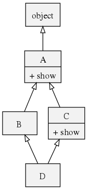

MRO
========
MRO(Method Resolution Order)即“方法解析顺序”，是在支持继承的编程语言中，定位子类方法(属性)的一种算法。因为子类的方法(属性)可能来源于自身的定义或父类的继承。

看一个典型的**菱形继承**例子：



这种情况下，执行D.show()会执行A.show()还是C.show()呢？显然，如果方法的查找顺序是[D, B, A, C, object]的话，会执行A.show()；而如果顺序是[D, B, C, A, object]的话，则是C.show()。

Python在创建之初至今，采用过三种MRO，而Python3+只支持一种，就是C3算法。

## C3算法

我们把类C的MRO记为 L[C] = [C1, C2,…,CN]。其中C1称为L[C]的**头**，其余元素[C2,…,CN]称为**尾**。如果一个类C继承自基类B1、B2、……、BN，那么可以根据以下两步计算出L[C]：
> 1. L[object] = [object]
> 1. L[C(B1…BN)] = [C] + merge(L[B1]…L[BN], [B1]…[BN])

这里的merge是一个输入一组列表输出一个列表的函数，计算步骤如下：

> 1. 检查第一个列表的头元素（如L[B1]的头），记作H。
> 1. 若H未出现在其它列表的尾部，则将其输出，并将其从所有列表中删除，然后回到步骤1；否则，取出下一个列表的头部记作H，继续该步骤。
> 1. 重复上述步骤，直至列表为空或者不能再找出可以输出的元素。如果是前一种情况，则算法结束；如果是后一种情况，说明无法构建继承关系，Python会抛出异常。

如上例中的**菱形继承**例子：

> L[object] = [object]
> 
> L[A] = [A, object]
> 
> L[B(A)] = [B] + merge(L[A], [A])  
> 　　　   = [B] + merge([A, object], [A])  
> 　　　   = [B] + [A] + merge([object])  
> 　　　   = [B] + [A, object]  
> 　　　   = [B, A, object]  
> 
> 同理 L[C(A)] = [C, A, object]
> 
> L[D(B, C)] = [D] + merge(L[B], L[C], [B], [C])  
> 　　　　　= [D] + merge([B, A, object], [C, A, object], [B], [C])  
> 　　　　　= [D] + [B] + merge([A, object], [C, A, object], [C])  
> 　　　　　= [D] + [B, C] + merge([A, object], [A, object])  
> 　　　　　= [D] + [B, C, A] + merge([object], [object])  
> 　　　　　= [D] + [B, C, A, object]  
> 　　　　　= [D, B, C, A, object]  

## 摘木板方法
上面的C3算法不直观，需要一步步计算，我有一个突发奇想可以直观快速的得出MRO，叫他**“摘木板”**方法。

> 我们把一个个类看做一块块木板，每个木板上面有数目不一的钩子，每个钩子可以钩住另一块木板的底部，钩住了就表示继承关系。  
> 把待求解网状木板集一块块取下并排成一排，就是其MRO的顺序。  
> 要点是**从要得到MRO的那个类开始**，**一次只能拿一块木板**，如果同时有多个可取木板，则按**从左到右**的优先级摘取。  

## MRO相关
#### 代码中获取MRO的方法
如类C，有如下方法：
```
1. C.mro() -> list
2. C.__mro__ -> tuple
3. inspect.getmro(C) -> tuple
```
#### super(cls, inst)
源码类似于：
```
def super(cls, inst):
    mro = inst.__class__.mro()
    return mro[mro.index(cls) + 1]
```
#### 类的直接子类
```
C.__subclasses__() --> list
```
#### 新式类
Python自创建之初至今采用过两种类形式，旧式类和新式类，Python3+只支持新式类。
新式类都直接或间接继承自object类。

## 旧式类的MRO
Python在确立C3算法前，先后采用过**深度优先**和**广度优先**两种MRO。


